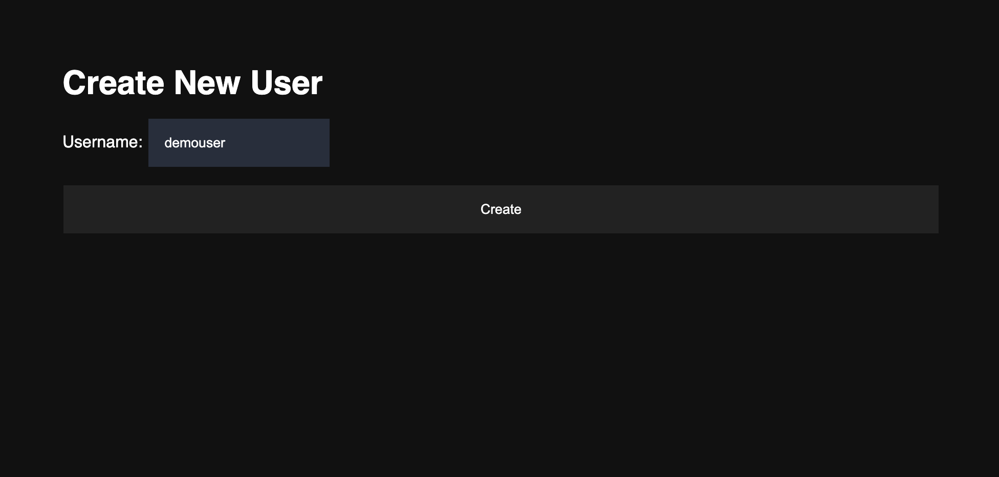
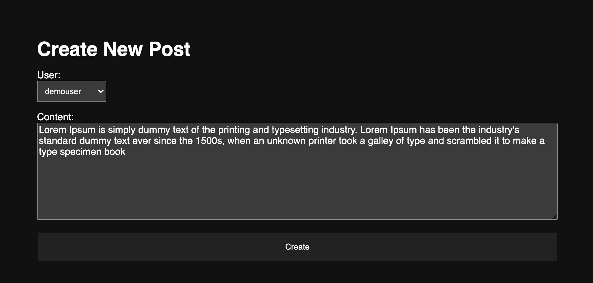
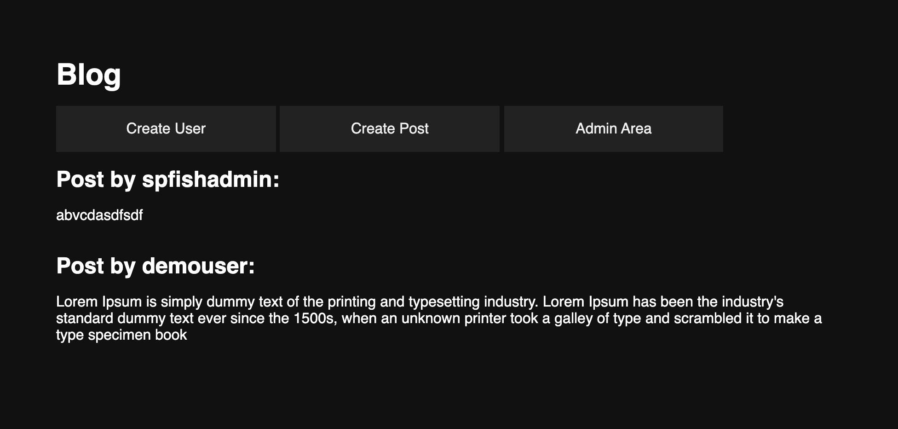
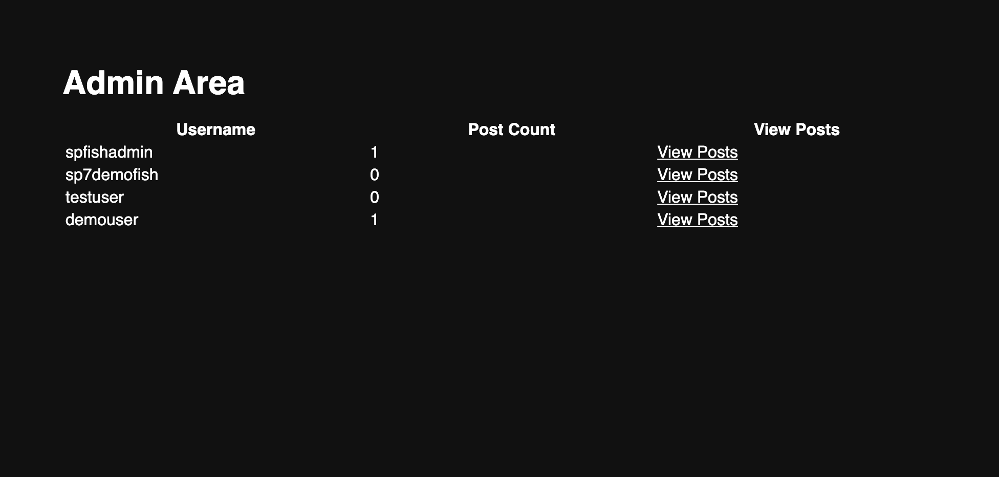

# EECS 448 Lab 10

Embarrassingly basic HTML stuff that I am forced to do for my college classes

## Overview

### Create User



### Create Post



### Main Page



### Admin Panel



### Admin Panel: User Posts


## Deployment

Edit the database connection credentials in `./src/components/mysql.php`

### Development

```zsh
npm i # install development dependencies
```

Open `./index.html` in your browser.

After making edits, refresh the page

### Production

Open `./index.html` in your browser.
